# Setting up and using Memory Machine Cloud with Jupyter Notebooks

## Setup *OpCenter*

Follow the extensive
[documentation](https://docs.memverge.com/mmce/2.2/userguide/olh/oxy_ex-1/topics/a_mmce_gettingstarted_22.html)
on how to install the *Memory Machine Cloud OpCenter* on AWS.

## Security group configuration

Next, you need to update your Security Group settings to allow for inbound
connection to your MMCloud instance through the browser. This will allow you to
have access to your Jupyter Notebook server.

1. In your AWS VPC console, select "Security -> Security groups"
2. Click on the Security Group with a name that includes
   "mvOpCenterSecurityGroup". For example, this group will have a name similar
   to "<your-stack-name>-mvOpCenterSecurityGroup-<random-string>".
3. Click on the "Inbound rules" tab.
4. Click on the "Edit inbound rules" button.
5. Click on the "Add rule" button.
6. Select "Custom TCP" from the "Type" dropdown.
7. Enter "8888" in the "Port range" field (this port number is typical for
   Jupyter notebook servers.)
8. In the "CDIR Block" field, enter "0.0.0.0/0" to allow connection from any IP
   address (or enter a specific IP address to restrict access to that IP).
9. Click on the "Save rules" button.

## Job creation

To use Jupyter Notebook on MMCloud, we need to create a new Job to start
the Jupyter Server. The `jupyter_server` image provides a Docker container with
all the necessary tools installed.

A *Job Script* has to be specified with the following content:

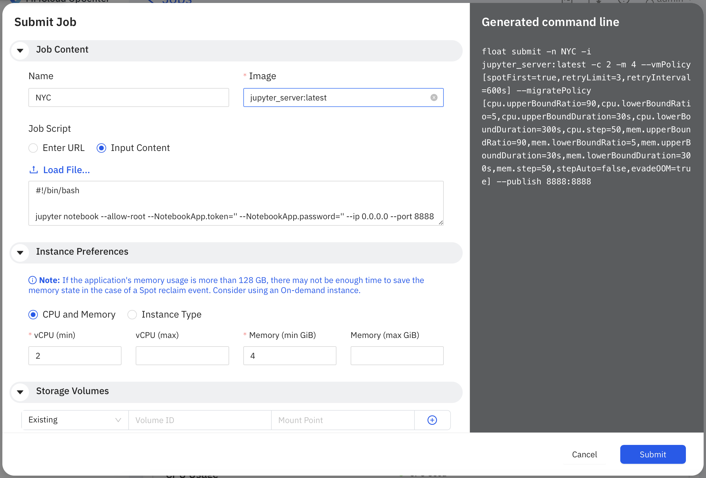

```bash
#!/bin/bash

LOG_FILE=$FLOAT_LOG_PATH/output
touch $LOG_FILE
exec >$LOG_FILE 2>&1

python3 set_jupyter_password.py

jupyter notebook --allow-root
```

> **ℹ️ Improvements**
> 
> Until the image is adapted, Jupyter has to be started without
> credentials.
> 
> ```
> #!/bin/bash
>
> jupyter notebook --allow-root --NotebookApp.token='' --NotebookApp.password='' --ip 0.0.0.0 --port 8888
> ```
> 
> Ideally, 2 images would be provided:
> 1. Start a server and provide instructions on how to connect to it locally
> 2. Start a full Notebook (or Jupyter Lab) environment.
> 
> On the library side itself, it would be handy to be able to start a Job
> by clicking on the images. We should also get some documentation there.
> 
> Lastly, being able to re-use a Job's configuration would be very handy as to
> not have to re-configure jobs manually when they are the same. A restart
> option would be handy too.
> 

Besides specifying instance preferences, we want to activate the auto migration
policy which will help migrate our workload in case we need more resources.

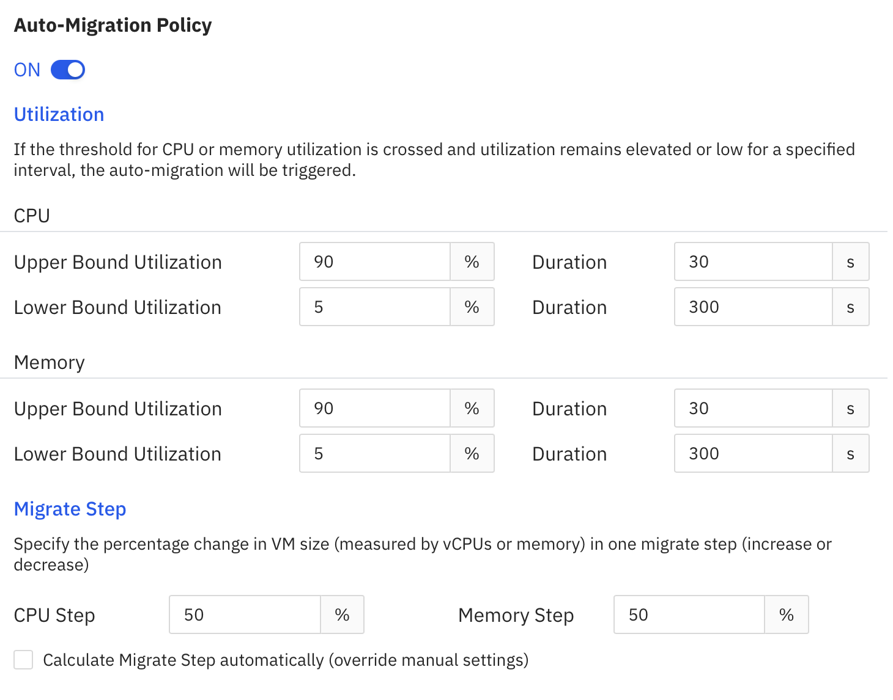

Next, update the port configuration in *Advanced/Network* and publish the
typical port for the Jupyter Notebook webApp `8888:8888` and to use the
Security group you set up earlier.

> **ℹ️ Improvements**
> 
> We need to manually update the *SecurityGroup* to allow the inbound port.
> It would be very convenient to adjust the *SecurityGroup* (or create one
> for a given Job) automatically.
>
> Also, in case of Jupyter Notebooks, the default port should be pre-filled.

The Job creation should take a few minutes to provision our instance. Once
this is done, we will have access to a public IP (shown in the Job Details
interface for MMCloud) we can connect to from a web browser (using the port
8888, as specified.)

> **ℹ️ Improvements**
> 
> There could be a button to open the public IP on the proper port.

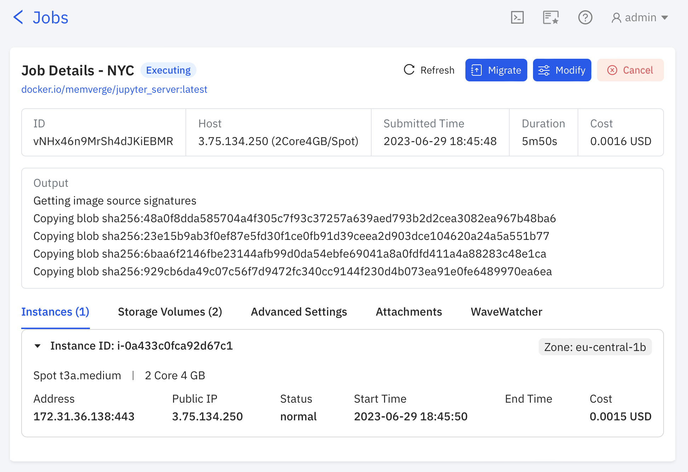

## Running Jupyter Notebooks

Once we are connected to the Jupyter Notebook interface, we can load our
[Notebook](https://github.com/Quansight/memverge-jupyter/blob/main/Notebooks/01_NYC_Yellow_Taxi_Tips_Prediction.ipynb)
and start exploring.

We start by loading a dataset which fits in the available memory and make
some preliminary analysis.

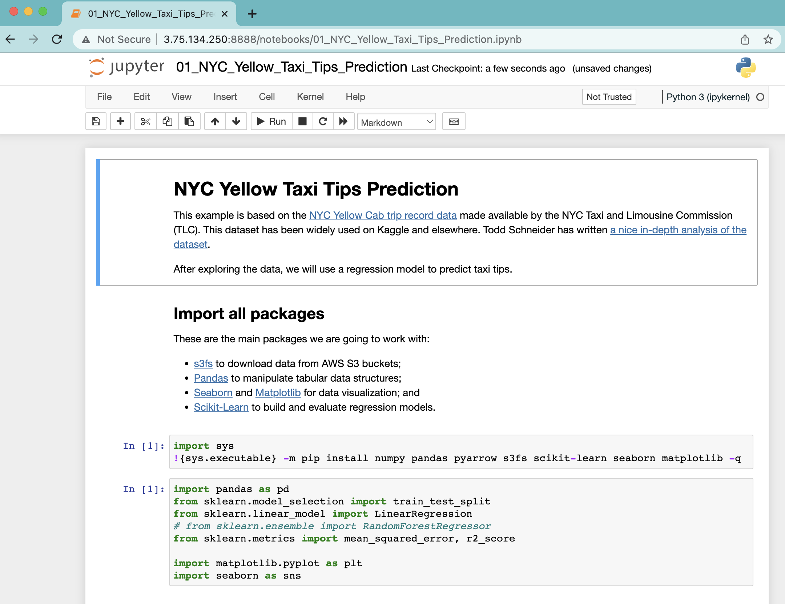

Once we are finished, we might want to load more data to make for instance
a comparative analysis with previous months/years. Doing so will increase
our memory needs and the instance we are working on might not have enough
memory. This would typically result in a crash and we would lose the work we
have done so far.

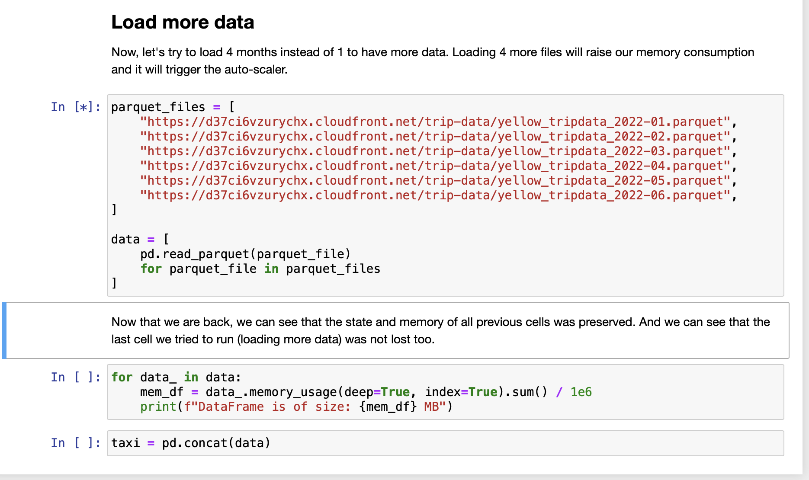

## Migrating to another instance

Memory Cloud is helping us as we can move from one instance to another larger
instance depending on our workload. It does the migration by saving the current
state of the instance. Which means that we are not losing any work in the
process!

There are 2 ways to migrate our deployment. We can either go to a Job's detail
page and use the *Modify* button, or use the auto-scaling feature.

By default, the auto migration will trigger as soon as the memory starts to
swap.
In the previous step, we loaded more data than the available RAM, which then
triggered a migration to a larger instance. The new instance type is selected
based on the auto migration policy.

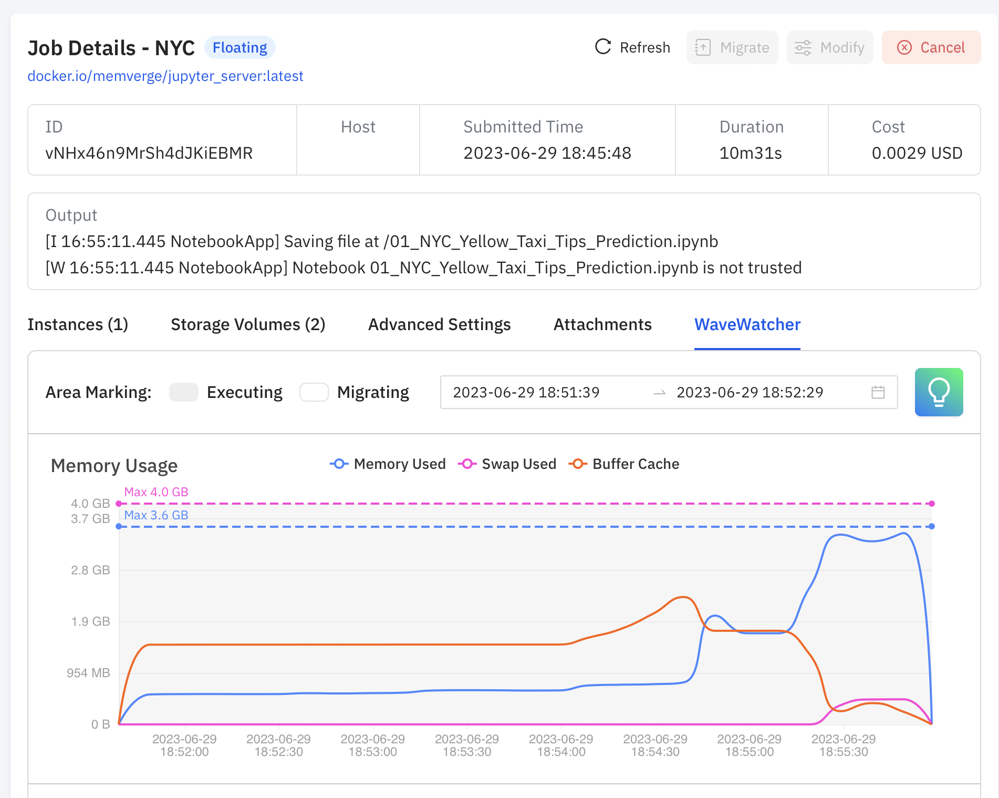

After the migration is completed, a new instance is available, and we get a
new IP we can connect to.

> **ℹ️ Improvements**
> 
> Here as well, having a button for the public IP would be handy.
> 
> An even better solution would be to use Jupyter Lab locally and connect to
> a remote `jupyter_server` on the cloud. We could have a MMCloud Jupyter Lab
> extension that would detect the migration and get the new IP and do the
> reconnection.

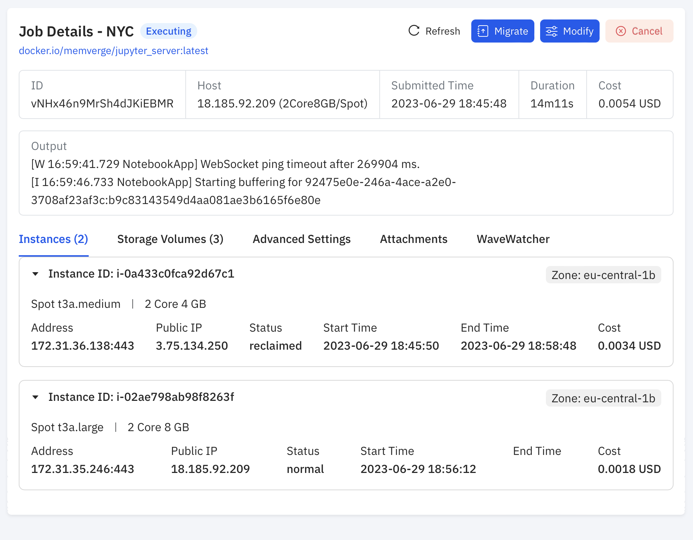

On the Job's detail page, we can look at *WaveWatcher* and see how the
migration happened with respect to the provisioned and requested resources.

> **ℹ️ Improvements**
> 
> I would like to see the auto migration policy on the graphs and know why
> a Job got migrated. If it's due to the CPU or MEM policy.

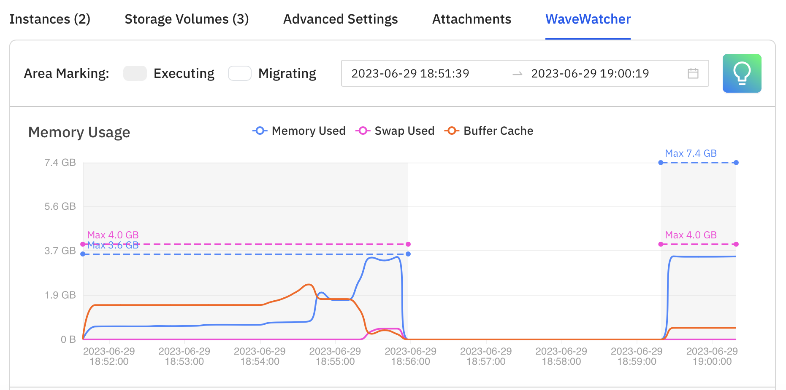

## Continue to explore as nothing happened

Going to the new instance, our Notebook is already running, our Job resumed
exactly where it stopped.

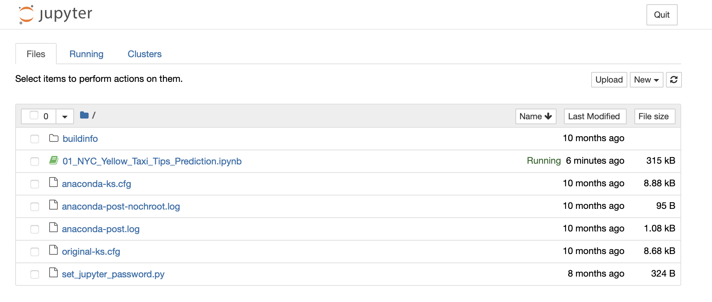

We have access to all the previous cells, and we confirm that by running the
next cell.

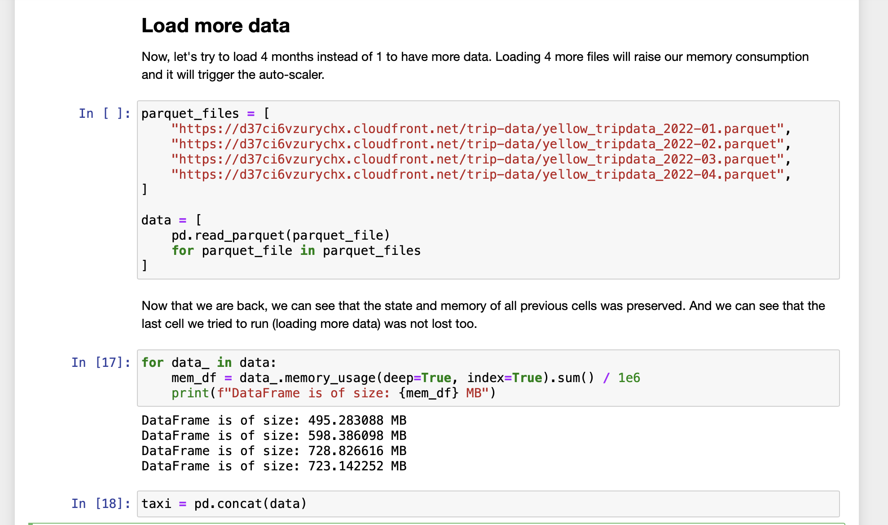

On *WaveWatcher* we can see that we have new limits allowing us to load our
new dataset without any issues.

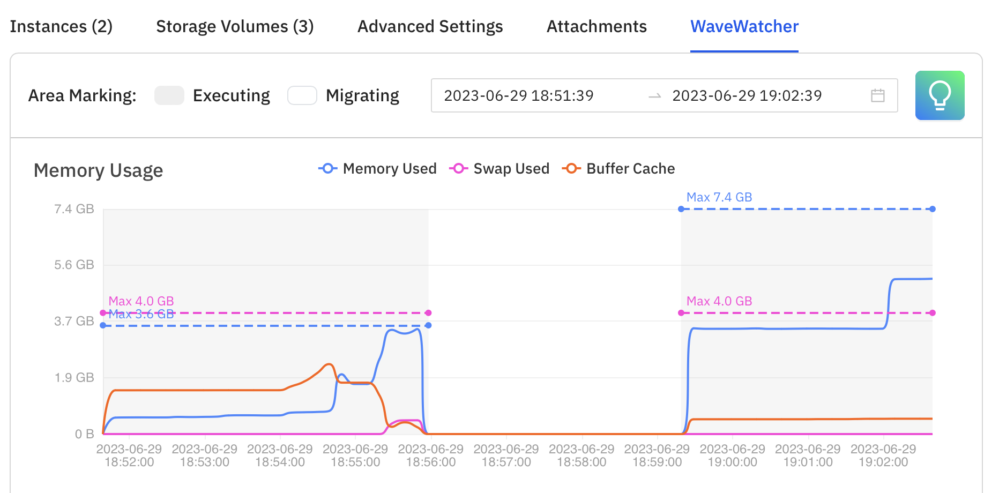
