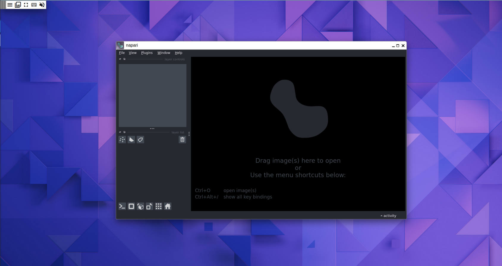

# How to set up napari with MMCloud

napari is a powerful interactive viewer for multi-dimensional images in Python. Together with its rich plugin ecosystem, it can be extended to provide complex image analysis and processing.

For computationally intensive tasks, it can be used together with MMCloud both in an interactive setting and as a batch processing tool.

## Set up

### Setup *OpCenter*

Follow the extensive
[documentation](https://docs.memverge.com/mmce/2.2/userguide/olh/oxy_ex-1/topics/a_mmce_gettingstarted_22.html)
on how to install the *Memory Machine Cloud OpCenter* on AWS.

### Enable the custom napari docker image

napari can be used as an interactive graphical application or as a Python library. In both cases, we need to use a [special docker image](https://napari.org/dev/howtos/docker.html#napari-xpra-image) on MMCloud. The image we are going to use is the [napari-xpra](https://github.com/napari/napari/pkgs/container/napari-xpra) image, and you can get the URI for the latest version of the image on that page (it should look like `ghcr.io/napari/napari-xpra:sha-<latest-sha-hash>`), where `<latest-sha-hash>` is a random combination of numbers and letters. To enable this image, follow the procedure below:

1. Go to your MMCloud interface and select "App Library"
2. Click on the "Private" tab and then "Add Image"
3. Give the image a name (the suggested name is `napari-xpra`) and paste in the URI: `ghcr.io/napari/napari-xpra:sha-<latest-sha-hash>`. Click on "Add"

You are now ready to submit a new job using the napari docker image.

> **Note:** You can also submit this image with the following command on the MMCloud CLI: 
>
> ```bash
> float image add napari-xpra ghcr.io/napari/napari-xpra:sha-<latest-sha-hash>
> ```

### Security group configuration

Next, you need to update your Security Group settings to allow for inbound
connection to your MMCloud instance. This will allow you to have access to the napari application through the browser.

1. In your AWS VPC console, select "Security -> Security groups"
2. Click on the Security Group with a name that includes "mvOpCenterSecurityGroup". For example, this group will have a name similar to `<your-stack-name>-mvOpCenterSecurityGroup-<random-string>`.
3. Click on the "Inbound rules" tab.
4. Click on the "Edit inbound rules" button.
5. Click on the "Add rule" button.
6. Select "Custom TCP" from the "Type" dropdown.
7. Enter `9876` in the "Port range" field (this port number is the default for the napari-xpra image.)
8. In the "CDIR Block" field, enter "0.0.0.0/0" to allow connection from any IP address (or enter a specific IP address to restrict access to that IP).
9. Click on the "Save rules" button.

### Create a job with the napari image

To create a job using this image, you will need to click on "Submit Job" on your MMCloud interface, and fill the following information:

1. On the "Job Content" section, make sure you select the `napari-xpra` image you just added, and give the job a descriptive Name.
2. Next, you want to either enter a url or input the desired content for your job. Since we want to use napari interactively at this point, we will leave this field empty.
3. On the "Instance Preferences" section, make sure you select a machine that is appropriate to your needs. For example, you may want to select a machine with 2 vCPU and 4Gb of memory. Feel free to fill other parameters as needed.
4. Now we will navigate to the "Advanced" section where we will define our VM "Policies" as needed (feel free to leave settings as they are right now if you don't know what to pick). Next, check out the "Environment Variables" tab and fill in the following Key/Value pair:
    - Key: `XPRA_PORT`, Value: `9876` (remember, this is the port we configured on our Security Group settings)
   Check the [napari documentation](https://napari.org/dev/howtos/docker.html#napari-xpra-image) for other environment variables you can set up.
5. In the "Network" tab, we are going to fill in the Security Group we set up earlier - the Security Group id should look like `sg-<random-string>`. We will also fill in the "Publish Port" field with `9876:9876`.

> **Note:** If you are using the graphical web interface for MMCloud, you can see the equivalent MMCloud CLI commands you can use to submit this job on the right side of this dialog. For the job we just described, the CLI command would be something like:
>
> ```bash
> float submit -n <job-name> -i napari-xpra:sha-<latest-sha-hash> -c 2 -m 4 -e XPRA_PORT=9876 --vmPolicy [spotFirst=true,retryLimit=3,retryInterval=600s] --migratePolicy [disable=true] --securityGroup sg-<random-string> --publish 9876:9876
> ```

You are now all set! Click "Submit" on the Submit Job dialog and wait for your job to be started. Once the status for your job shows as "Executing", use the Public API listed in the Job Details dialog and connect to it using the following URL on your browser: `http://<public-ip>:9876`

On your browser window, you should now see a napari window floating over a lightweight desktop environment.
    



